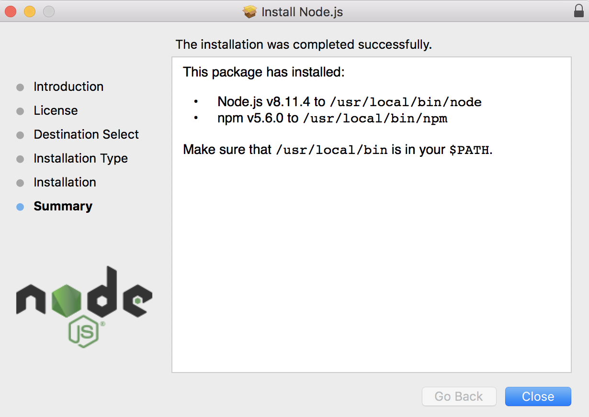

#  WEEK 2 : DATA
One way to define the Internet is Combination of data  software and computers
- First
- Second
- Third

## Low and high code:

- Low: binary, machine code, not everybody would learn
A part of being an artist is to look at things in a unordinary way.

```html
<a href="http://saic.edu">school</a>
```
my favorite *function* in **JavaScript** is



```js
Math.random()
```


- High: sambly

Arabic numerals/ decimal/ BASE 10/ : 0 1 2 3 4 5 6 7 8 9
Roman numerals: I V X C M L

 Code: something that represent/maps to something-else

234 :   100s, 10th column, 1st column

Numbering systems changed humanity forever.

Why use ten symbols?: Probably because we have 10 fingers
Base 8: If we only have 8 numbers: 0 1 2 3 4 5 6 7
      234: 16th, 8th column, 1st column  =  32+24+4

Base 16(hex): 0 1 2 3 4 5 6 7 8 9 A(10) B C D E F
the largest number we can represent is FF = a byte
FF = F * 16 + F
    = 15 * 16 + 15
    = 255

Base 2 (binary): 0 1
      10011101: 128, 64, 32, 16, 8, 4, 2, 1 = 128+ 16+ 8+4+1= 157

1
1
1
1
1
1
1
1
128
64
32
16
8
4
2
1

a byte: if we only have 8 columns , the largest number we can represent is 255

Analog vs digital: circle represent infinite sides in analog, but limited(128 in max/msp) sides in digital.


Analog: RGB: primary colors
For painters: Red yellow and blue can mix any color.
With light, combine red green and blue, you can get any color

Same quantity is different number systems: 255(decimal) = FF(hex) =11111111(base2)
then 255 is the maximum value that you can represent with an unsigned 8-bit byte, which is 11111111 in base 2 and FF in base 16.

1800s first computers were powered by steam engines, not electronics
Binary is perfect for computers,  for electricity to run through.

Places to data: CD , Hardrive
                         Online: someonelse’s hard drive
                          Floppys
                          Pounch cards

volatile storage & non-volatile (paper, dvd, punch cards)


The heart of computer: CPU, central processing unit.
CPU takes data, stored in memory\RAM, Hard-drive
Digital data takes form


B R E A KKKKKKKKKKKKKKKKKKKKKKKKKKKKKKKKKKKKKKKKKKKKKKKKKKKKK

Lev Manovich:
Lev Manovich is an author of books on new media theory, professor of Computer Science at the City University of New York, Graduate Center, U.S. and visiting professor at European Graduate School in Saas-Fee, Switzerland. Manovich's research and teaching focuses on digital humanities, social computing, new media art and theory, and software studies.[1]

computer does not save text, but binary numbers.

ASCII（發音： /ˈæski/ ass-kee[1]，American Standard Code for Information Interchange，美国信息交换标准代码）是基于拉丁字母的一套电脑编码系统。它主要用于显示现代英语，而其擴展版本EASCII則可以部分支持其他西欧语言，并等同于国际标准ISO/IEC 646。

ASCII (/ˈæskiː/ ( listen) ASS-kee),[1]:6 abbreviated from American Standard Code for Information Interchange, is a character encoding standard for electronic communication. ASCII codes represent text in computers, telecommunications equipment, and other devices. Most modern character-encoding schemes are based on ASCII, although they support many additional characters.
Unicode is a computing industry standard for the consistent encoding, representation, and handling of text expressed in most of the world's writing systems. The standard is maintained by the Unicode Consortium, and as of June 2018 the most recent version, Unicode 11.0, contains a repertoire of 137,439 characters covering 146 modern and historic scripts, as well as multiple symbol sets and emoji. The character repertoire of the Unicode Standard is synchronized with ISO/IEC 10646, and both are code-for-code identical.

We didn’t change the data, when we open the same file with different extensions in different  
Softwares( eg.change txt into raw and open it in photoshop doesn’t change the data)

A F T ERNOOOOOOOOOOOOOOOOOOOOOOOOOOOOOOOOON

Metamedia: data about data, stored in the header,
                    body of the file is all the raw data
Numbers to texts:  a system to making number values
Smart phone: We can digitize vibrations
How to Output(digitize) smell:

Why do we have different formats:
compression

In Atom:
* Command + D select -
Then
* commond+ shift +left

* Control + shift + M  OPEN NOTES PREVIEW

* # to creat header
More ## more smaller
* COMMAND + SHIFT + P to search


* Italitaze *      *
           Bold       **     **
* Upload photos:   文件必须在同一个文件夹

<!-- THIS IS A COMMENT —>

md file and xml file

coding vs programming
